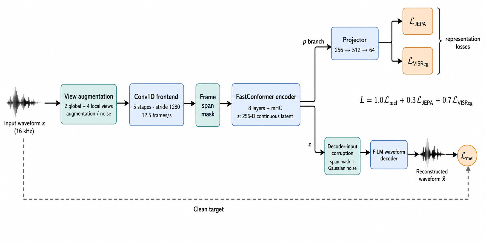

# Continuous Latent Autoencoder for Bengali Speech Representation Learning

**Updated:** 2 August 2026  
**Evaluated model:** 170,000-step CLAE checkpoint

## Executive summary

This thesis develops a compact **15.29M-parameter speech representation
encoder** within a continuous-latent autoencoder (CLAE) for 16 kHz Bengali
speech. The evaluated representation—the convolutional frontend and
FastConformer/mHC encoder—emits a continuous 256-dimensional sequence at
**12.5 frames per second**. The primary research goal is downstream semantic
and discriminative representation quality rather than a deployment audio
codec.

The evaluated model was trained for **170,000 optimizer steps**. Under the
documented effective batch size and three-second crop length, this corresponds
nominally to **28.56M training samples, 23,800 audio hours, and 22.95
training-manifest-equivalent passes**.
These are exposure-equivalent figures: augmentation, random cropping, and
repeated sampling mean that they are not counts of unique audio.

Evaluation shows that training produced substantial non-random structure. The
clearest result is closed-set speaker identification: **65.6% test accuracy**,
compared with **4.5%** for the identical randomly initialized encoder and
64.7% for Mimi. Emotion recognition reaches **49.6% macro-F1**, an 18.0-point
gain over the random control, but remains below most pretrained baselines.
Speaker verification, age classification, and attention-based ASR are weaker;
in particular, the ASR result indicates that the low-rate latent does not yet
preserve linguistic content as effectively as WavLM under the reported probe.

## Research objective

Given waveform \(x\), the system learns a continuous encoder representation
\(z\) from which a decoder reconstructs clean speech. A separate projector
maps \(z\) into \(p\) for representation-learning losses. The decoder and all
reported frozen-feature probes consume **encoder latent \(z\)**, not projector
output \(p\). This prevents the downstream representation from being identical
to the space directly constrained by JEPA and VISReg.

Accordingly, the evaluation prioritizes emotion, speaker, age, and linguistic
content probes. The decoder currently supplies a reconstruction learning signal
but is not treated as the principal research output. Strong waveform
reconstruction would require substantially more dedicated training, so detailed
decoder-quality claims and reconstruction benchmarks are deferred at this
stage.

The configured objective is:

```text
L_total = 1.0 L_mel + 0.3 L_JEPA + 0.7 L_VISReg
```

- **Mel reconstruction** compares reconstructed audio with the clean target in
  an 80-bin log-mel domain (FFT/window 1024, hop 256).
- **JEPA consistency** uses two global and four local augmented views. Global
  projector features define a per-frame centre, and both global and local
  features are trained toward it with mean-square error.
- **VISReg** applies 256 random projections to pooled projector features and
  encourages centred, unit-scale, isotropic Gaussian-like geometry.
- The decoder input is further regularized with latent span masking and
  Gaussian noise.
- Adversarial and feature-matching losses are **disabled** for this model.

The architecture and objective are defined by
[`configs/large_2kh.yaml`](configs/large_2kh.yaml), with packed-data loading in
[`configs/large_2kh_packed.yaml`](configs/large_2kh_packed.yaml).

## Architecture



*Figure: Training flow for the continuous-latent autoencoder. The clean input
provides the reconstruction target; augmented views pass through the frontend,
frame masking, and encoder before branching into the representation and
waveform-reconstruction objectives. The single path is schematic: frontend
frame masking applies only to local views; global views bypass that mask.*

| Component | Configured design | Parameters | Share |
|---|---|---:|---:|
| Frontend | Five Conv1D stages; channels 128/256/384/512/512; kernels 10/8/8/4/4; strides 5/4/4/4/4; GroupNorm + GELU | 2,890,240 | 12.1% |
| Encoder | Eight-layer FastConformer; `d=256`; 8 heads; FFN 1024; 9-tap convolution; dropout 0.1; squeeze-excitation; two-stream mHC mixing at zero-indexed layers 2 and 5 | 12,403,220 | 52.1% |
| Projector | Per-frame BatchNorm/GELU MLP, 256 → 512 → 64 | 165,440 | 0.7% |
| Decoder | FiLM-conditioned residual waveform decoder; 768 initial channels; strides 4/4/4/4/5; two residual blocks per stage; dilations 1/3/9 | 8,344,225 | 35.1% |
| **Total** |  | **23,803,125** | **100%** |

The full 23.80M-parameter training architecture is shown for transparency. The
headline **15.29M** count used in this report is the evaluated frozen feature
extractor (frontend + encoder: 15,293,460 parameters), which is the component
used for downstream comparisons.

The frontend stride is \(5\times4\times4\times4\times4=1{,}280\) samples.
At 16 kHz, this gives one latent frame every 80 ms, or 12.5 frames/s.

```text
clean 16 kHz waveform
        │
        ▼
5-stage Conv1D frontend ──► 12.5 frames/s
        │
        ▼
8-layer FastConformer + two-stream mHC
        │
        ├── z (256-D) ──► masked/noisy FiLM decoder ──► waveform ──► L_mel
        │
        └── projector (256 → 512 → 64) ──► L_JEPA + L_VISReg
```

## Dataset

The four Bengali corpora contain **1,310,076 utterances** with close to 2,000
total hours of audio.

| Dataset | Utterances |
|---|---:|
| Common Voice Bengali | 1,052,178 |
| OpenSLR-53 | 218,703 |
| regspeech12 | 21,313 |
| shrutilipi | 17,882 |
| **Total** | **1,310,076** |

| Split | Utterances |
|---|---:|
| Train | 1,244,572 |
| Validation | 65,504 |

## Training history

The configured training setup uses batch size 42, four gradient-accumulation
steps (**effective batch 168**), three-second segments, AdamW, BF16 mixed
precision, gradient clipping at 1.0, and a 5,000-step warm-up followed by
cosine decay.

| Milestone | Status |
|---|---|
| 50,000 steps | A checkpoint existed and was used to start the packed-data recovery run |
| 170,000 steps | Checkpoint used for all evaluation results in this report; confirmed by the experiment owner |

The recovery command changed the configured base learning rate from
**1e-3 to 5e-4** and resumed with the packed TAR loader. The runtime warning
records that the scheduler was reconstructed using the current learning-rate
inputs. Because the step-50,000 checkpoint predated packed `data_epoch` state,
resume used the legacy step-seeded epoch fallback.

### Derived exposure at 170,000 steps

Assuming the documented effective batch and segment length remained unchanged:

| Metric | Derived value |
|---|---:|
| Optimizer steps | 170,000 |
| Samples processed | 28,560,000 |
| Audio duration processed | 85,680,000 s |
| Audio hours processed | 23,800 h |
| Training-manifest equivalents | 22.95× |

The checked-in base configuration retains a 100,000-step maximum and scheduler
horizon. The exact continuation overrides or invocation used to reach 170,000
steps are not available, so the exposure calculation assumes the documented
effective batch and segment length remained unchanged after the recovery run.

## Evaluation of the 170,000-step checkpoint

All `ours` results below refer to the trained CLAE checkpoint at 170,000 steps.
`ours_random` uses the same feature-extractor architecture without training and
is the most direct control for whether the learned features add information.

### Emotion recognition

Protocol: all **7,000 SUBESCO utterances**, seven emotions, speaker-disjoint
five-fold evaluation, mean+standard-deviation pooling, chance level 14.3%.

| Model | Macro-F1 | Accuracy |
|---|---:|---:|
| CLAE (ours) | **49.6 ± 6.2** | **50.0 ± 6.6** |
| Random CLAE | 31.6 ± 2.8 | 32.1 ± 2.7 |
| WavLM | 60.7 ± 8.0 | 61.0 ± 8.2 |
| Whisper-tiny | 63.2 ± 5.8 | 63.3 ± 5.9 |
| ECAPA | 52.3 ± 4.9 | 52.5 ± 5.1 |
| emotion2vec | 63.0 ± 6.4 | 63.3 ± 6.7 |
| Mimi | 61.6 ± 7.7 | 62.3 ± 7.3 |
| Higgs Audio V2 | 46.1 ± 4.0 | 46.7 ± 3.8 |

CLAE improves over its random control by **18.0 macro-F1 points** and **17.9
accuracy points**. It exceeds Higgs Audio V2 in this protocol, but trails the
other trained baselines. Fold-level variation remains material.

### Closed-set speaker identification

Protocol: **1,000 utterances from 167 enrolled speakers**, with held-out
utterances from the same speakers; chance accuracy is 0.6%.

| Model | Test accuracy | Train accuracy |
|---|---:|---:|
| CLAE (ours) | **65.6%** | 100.0% |
| Random CLAE | 4.5% | 100.0% |
| WavLM | 29.6% | 100.0% |
| Whisper-tiny | 35.0% | 100.0% |
| ECAPA | 95.2% | 100.0% |
| emotion2vec | 32.3% | 100.0% |
| Mimi | 64.7% | 100.0% |
| Higgs Audio V2 | 73.7% | 100.0% |

CLAE gains **61.1 accuracy points** over its random control. It ranks third
among the seven trained models reported here, narrowly exceeding Mimi and
substantially exceeding WavLM, Whisper-tiny, and emotion2vec. ECAPA remains the
clear specialist leader. The 100% training accuracy for every model makes the
held-out test score, rather than training fit, the meaningful comparison.

### Speaker verification

Protocol: **2,000 utterances from 334 speakers**, all-pairs cosine scoring.
Lower equal-error rate (EER) and minDCF are better.

| Model | Mean EER | Mean minDCF | Mean+std EER | Mean+std minDCF |
|---|---:|---:|---:|---:|
| CLAE (ours) | **28.38%** | 0.993 | **27.98%** | 0.988 |
| Random CLAE | 44.11% | 1.000 | 39.43% | 1.000 |
| WavLM | 32.41% | 0.998 | 33.89% | 0.999 |
| Whisper-tiny | 37.47% | 0.998 | 37.45% | 0.998 |
| ECAPA | 5.99% | 0.555 | 5.99% | 0.555 |
| emotion2vec | 35.49% | 1.000 | 34.41% | 1.000 |
| Mimi | 26.42% | 0.998 | 23.08% | 0.990 |
| Higgs Audio V2 | 24.44% | 0.994 | 18.53% | 0.953 |

The trained CLAE reduces EER relative to its random control by **15.73 points
with mean pooling** and **11.45 points with mean+std pooling**. It performs
better than the general-purpose WavLM, Whisper-tiny, and emotion2vec features,
but trails Mimi, Higgs Audio V2, and especially ECAPA. Mean+std pooling improves
CLAE EER only slightly, from 28.38% to 27.98%, and its minDCF remains high.

### Age classification

Protocol: **15,475 Common Voice Bengali clips from 1,580 speakers**, evaluated
with speaker-disjoint splits.

| Model | Balanced accuracy | Macro-F1 |
|---|---:|---:|
| CLAE (ours) | **27.8%** | **20.8%** |
| Random CLAE | 25.8% | 17.3% |
| WavLM | 29.8% | 25.2% |
| Whisper-tiny | 30.0% | 23.2% |
| ECAPA | 39.3% | 27.1% |
| emotion2vec | 29.0% | 24.8% |
| Mimi | 29.0% | 23.9% |
| Higgs Audio V2 | 27.9% | 23.6% |

Training improves CLAE over its random control by **2.0 balanced-accuracy
points** and **3.5 macro-F1 points**, but CLAE is the weakest of the trained
models on macro-F1. Age information is present, but it is not strongly exposed
by the current frozen representation and linear probe.

### Attention-based ASR diagnostic

Protocol: a fixed-budget two-layer Transformer-decoder probe, with 10,000
training and 10,000 development utterances, 15-second maximum utterances and
three-second feature chunks. Lower WER and CER are better.

| Features | Train WER | Train CER | Dev WER | Dev CER |
|---|---:|---:|---:|---:|
| CLAE (ours) | 93.41% | 68.17% | **111.30%** | **82.56%** |
| WavLM | 36.06% | 22.74% | 85.94% | 50.05% |

CLAE is substantially behind WavLM, especially on development CER. This is
consistent with the 12.5 Hz bottleneck retaining speaker and paralinguistic
information more successfully than detailed linguistic content. The supplied
ASR run predates the current duration-validation path, so these numbers remain
diagnostic until rerun with verified audio durations.

## Overall interpretation

The 170k model clearly learns useful speech structure: on every task for which
an architecture-matched random result is available, trained CLAE improves over
that control. Its strongest result is closed-set speaker identification, where
it is competitive with Mimi and stronger than several much larger
general-purpose representations. Emotion recognition is meaningful but not
state of the art, while speaker verification shows that separable closed-set
speaker classes do not yet translate into a strong open-set verification
embedding. Age results are modest, and ASR is the clearest weakness.

The current evidence supports the narrower conclusion that **CLAE is a compact
Bengali speech representation with strong speaker information and measurable
emotion information, but limited linguistic-content retention at its current
12.5 Hz bottleneck**. It does not yet support a claim of broad superiority over
pretrained speech encoders.

<!-- ## Recommended next milestone

1. Preserve the exact 170k checkpoint path/hash and all continuation overrides,
   particularly `train.max_steps`, scheduler horizon, and learning-rate state.
2. Rerun the ASR diagnostic with validated utterance durations and compare the
   same fixed train/dev sample identities across CLAE and WavLM.
3. Report confidence intervals or repeated seeds for speaker ID, verification,
   and age, complementing the existing emotion fold statistics.
4. Test whether a higher latent frame rate or a content-aware auxiliary loss
   improves CER without sacrificing the strong speaker-ID result.
5. Add reconstruction metrics and listening examples for the same 170k
   checkpoint so representation quality and waveform fidelity can be assessed
   together. -->

## Provenance note

Architecture, objective, and base training settings were checked against
[`SUPERVISOR_RESEARCH_REPORT.md`](SUPERVISOR_RESEARCH_REPORT.md),
[`CODEBASE.md`](CODEBASE.md), and the active configuration files. Parameter
counts, corpus counts, recovery output, and evaluation measurements come from
the supplied experiment log. The attribution of those measurements to the
170,000-step checkpoint was confirmed by the experiment owner on 2 August
2026. Derived exposure values assume the documented effective batch of 168 and
three-second segments remained unchanged through step 170,000.
